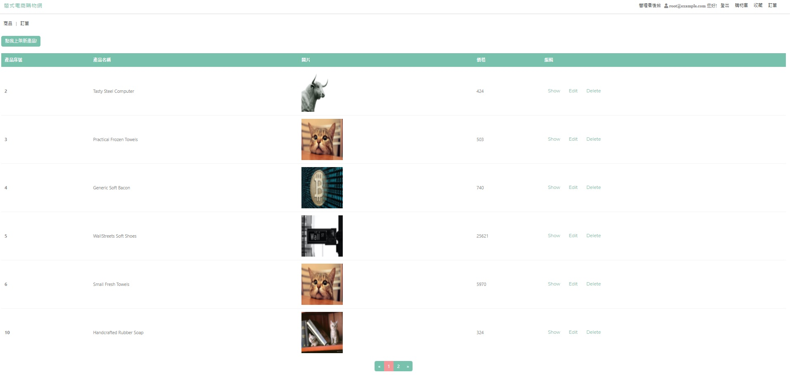

# Simple Shopping-cart

使用 Express, Node.js, Handlebars
製作一個簡易的購物車網頁。

[專案網址](https://tjshopping-cart-demo.herokuapp.com/)

# 專案畫面




# 功能描述 (features)

- 使用者可以在未登入的狀況下將商品加入購物車
- 使用者需要登入才能進入購物車頁面、收藏商品、觀看現有訂單
- 使用者可以用Facebook直接進行登入註冊
- 使用者登入後可以選擇付款或是取消該訂單
- 使用者可以登入訂單狀況看目前的出貨狀態(管理者需在後台更新)
- 使用者可以進入收藏頁面並且直接在收藏頁面將商品放入購物車
- 管理者可以新增(上架新商品)
- 管理者可以於後台編輯商品、管理商品
- 管理者可以於後台更新訂單的收款、出貨狀況

# 環境建置與需求 (prerequisites)

- "bcryptjs": "^2.4.3",
- "connect-flash": "^0.1.1",
- "cookie-parser": "^1.4.5",
- "crypto": "^1.0.1",
- "dotenv": "^10.0.0",
- "express": "^4.17.1",
- "express-handlebars": "^5.3.4",
- "express-session": "^1.17.2",
- "faker": "^5.5.3",
- "imgur": "^1.0.2",
- "imgur-node-api": "^0.1.0",
- "method-override": "^3.0.0",
- "multer": "^1.4.3",
- "mysql2": "^2.3.0",
- "ngrok": "^4.2.2",
- "nodemailer": "^6.6.5",
- "passport": "^0.5.0",
- "passport-facebook": "^3.0.0",
- "passport-local": "^1.0.0",
- "pg": "^8.7.1",
- "sequelize": "^6.6.5",
- "sequelize-cli": "^6.2.0"

# 安裝與執行步驟(installation and execution)

1. 打開終端機(Terminal)，Clone 此專案至本地電腦

```
git clone https://github.com/Jin0704/Shopping-cart.git
```

2. 開啟終端機，進入專案資料夾

```
cd Shopping-cart
```

3. 安裝 npm 套件

```
npm install
```

4. 使用 MySQL Workbench 建立資料庫

```
drop database if exists ac_twitter_workspace;
create database ac_twitter_workspace;
use ac_twitter_workspace;
```

5. 在終端機執行：把專案裡的 migration 設定檔同步到資料庫，並執行種子資料

```
npx sequelize db:migrate
npx sequelize db:seed:all
```

6. 執行 server

```
npm run dev
```

7. 開啟任一瀏覽器瀏覽器，輸入網址

```
http://localhost:3000
```

8. 種子資料中測試帳號

```
管理者：root@example.com
管理者密碼:12345678
```

